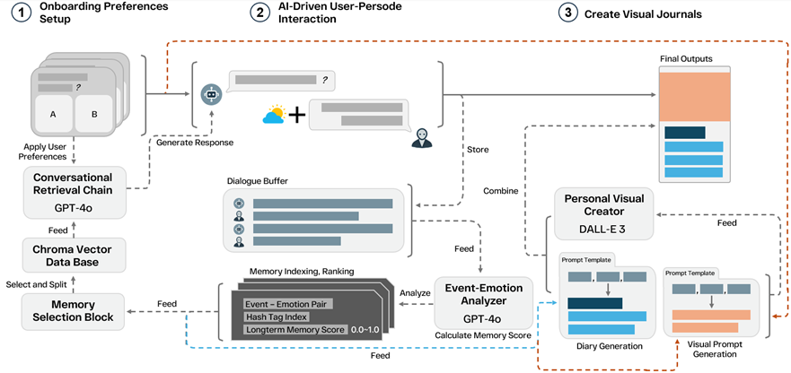
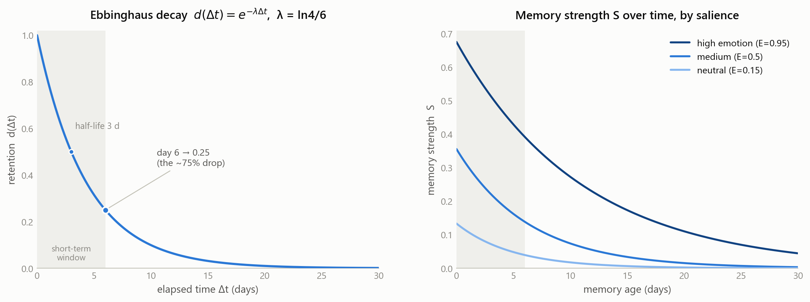
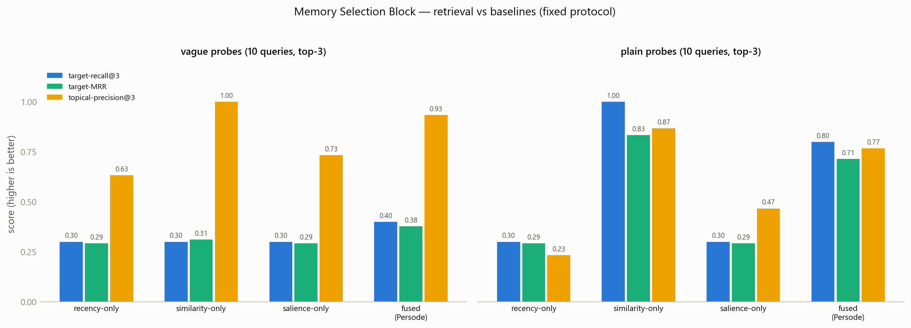

[English](README.md) | **한국어**

<div align="center">

# Persode

**에피소드 기억 인식 저널링 에이전트 — 충실한 오프라인 참조 구현**

Jin et al. (2025) [*Persode: Personalized Visual Journaling with Episodic Memory-Aware AI Agent*](https://arxiv.org/abs/2508.20585) 논문의 알고리즘 핵심을 재현합니다.

🏆 **Best Oral Presentation — ICES 2025**

[](https://arxiv.org/abs/2508.20585)
[](https://arxiv.org/abs/2508.20585)
[](pyproject.toml)
[](https://github.com/sukoji/persode/actions/workflows/ci.yml)
[](LICENSE)
[](#논문-충실도)

</div>

---

Persode는 사람처럼 기억을 다루는 저널링 챗봇입니다. 최근 사건은 **에빙하우스 곡선**을 따라 희미해지고, 감정적으로 강렬한 사건은 장기 저장으로 **통합(consolidation)** 되며, 검색은 **의미 유사도와 감정 현저성(salience)을 융합**해 회상하고 — 회상된 에피소드를 일러스트 일기(성찰 텍스트 + 개인화 이미지 프롬프트)로 렌더링합니다.

이 저장소는 그 **기억 핵심을 결정론적·오프라인으로 구현한 참조 구현**입니다. 논문의 GPT-4o / DALL·E 3 호출은 검사 가능한 투명 스텁으로 대체해, 기억 모델(Eq. 1과 그것이 구동하는 검색)을 유료 API 없이 단위 테스트·재현할 수 있게 했습니다. 선택적 어댑터([`persode/llm.py`](persode/llm.py))로 원본 LLM 파이프라인을 복원할 수 있습니다.

> **한 줄 범위.** 논문의 기여는 통합된 *시스템 설계*이며, **정량 평가는 보고하지 않습니다**(유저 테스트는 향후 과제로 명시). 따라서 이 repo는 **알고리즘 메커니즘**을 구현하고 자체 검증할 뿐, 논문 수치를 재현하지 않습니다 — 재현할 수치 자체가 없기 때문입니다. [논문 충실도](#논문-충실도) 참조.

## 아키텍처

<p align="center">
  
</p>
<p align="center"><sub><b>Figure 2</b> (<a href="https://arxiv.org/abs/2508.20585">논문</a>). 각 블록은 <code>persode/</code> 모듈에 대응하며, GPT-4o / DALL·E 3 블록은 오프라인 결정론적 구현으로 대체됩니다.</sub></p>

| 모듈 | 논문 | 역할 |
|---|---|---|
| [`memory.py`](persode/memory.py) | §4.2, Eq. 1 | 에빙하우스 감쇠 `d(Δt)=e^(−λΔt)`와 기억 강도 점수 `S = d(Δt)·(wE·E+wR·R+wC·C)/(wE+wR+wC)`, 현저성 조절 통합 포함 |
| [`analyzer.py`](persode/analyzer.py) | §4.2 | Event-Emotion Analyzer: 발화 → 사건, 감정, 강도 E, 해시태그 |
| [`store.py`](persode/store.py) | §3.2 | 벡터 저장소 + Memory Selection Block: 코사인 유사도와 현저성을 융합한 검색; 회상 시 기억 강화 및 감쇠 시계 리셋 |
| [`onboarding.py`](persode/onboarding.py) | §3.1, §4.1 | 온보딩 선호 → 챗봇 페르소나 + 시각 정체성 |
| [`templates.py`](persode/templates.py) | §3.3, §4.3 | Dual-Template 프레임워크: 성찰 일기 템플릿 + few-shot 시각 프롬프트 템플릿 |
| [`agent.py`](persode/agent.py) | Fig. 2 | `EpisodicMemoryAgent` — ingest → retrieve → respond → journal |
| [`embeddings.py`](persode/embeddings.py) | — | 교체 가능한 임베더: 오프라인 해싱(기본) 또는 sentence-transformers |
| [`llm.py`](persode/llm.py) | §4.1, §4.3 | 선택적 GPT-4o / DALL·E 3 어댑터 + 오프라인 스텁 |

## 빠른 시작

```bash
pip install -e .          # numpy + matplotlib 만 필요
python examples/demo.py   # 완전 오프라인 엔드-투-엔드 세션
```

```python
from persode import EpisodicMemoryAgent, MemoryStore, OnboardingPreferences

prefs = OnboardingPreferences(
    name="Mina", age=17, glasses=False, fashion_style="trendy",
    hair="dyed yellow hair", background_theme="city", background_style="vibrant",
    conversation_style="emotional", response_length="detailed", personality="empathetic",
)
agent = EpisodicMemoryAgent(preferences=prefs, store=MemoryStore())

agent.ingest("I celebrated my graduation today and I was overjoyed!")
print(agent.respond("I feel proud of myself lately, like when I graduated."))

entry = agent.create_journal("A car splashed water on me and ruined my favorite outfit!")
print(entry.diary)                 # 성찰 일기 항목
print(entry.visual_prompt.prompt)  # 개인화 이미지 생성 프롬프트
```

선택적 확장: `pip install -e ".[semantic]"` (sentence-transformers), `".[openai]"` (GPT-4o / DALL·E 어댑터), `".[dev]"` (pytest).

## 실험 재현

논문은 벤치마크를 보고하지 않으므로(유저 테스트는 향후 과제로 명시), 아래 네 스크립트는 각 메커니즘이 논문이 정성적으로 서술한 대로 동작하는지 확인하는 **구현 자체의 결정론적 검증**입니다. 모두 고정 기준 시계와 수작업 라벨 시나리오([`experiments/_scenario.py`](experiments/_scenario.py)) 위에서 수 초 내에 오프라인 실행되며, 그림 + 기계 판독 JSON을 [`results/`](results)에 씁니다.

**설계 원칙** (왜 이 실험들이 타당한가):
- **구조적 재현성** — 단일 고정 기준 시계(`NOW`)와 고정 시나리오 덕분에 모든 그림·숫자가 어떤 기계에서든 매 실행마다 비트 단위로 동일. 난수·네트워크 없음.
- **객관적·사전 선언 라벨** — "중요"는 `E ≥ 0.6`, "장기"는 `나이 > 6일`로 균일 적용; 대상은 검색 전에 고정. 결과를 유리하게 만들려고 항목별로 임의 선택하지 않음.
- **공정한 베이스라인** — 각 메커니즘은 반드시 이겨야 할 정직한 대안과 비교됨: 최근성 버퍼(Exp. 3), 순수 RAG 유사도(Exp. 3), 균형 Eq. 1 가중치(Exp. 2) — 허수아비가 아님.
- **감사 가능** — 모든 집계에 질의별/기억별 JSON이 동반되고, 트레이드오프(예: 쉬운 질의에서 융합의 손해, §Exp. 3)를 숨기지 않고 보고.
- **범위 정직성** — 이들은 *알고리즘 메커니즘*을 검증할 뿐, 논문의 유저 스터디가 아니며 그렇게 주장하지도 않음.

```bash
python experiments/run_all.py     # 아래 모든 그림 + JSON 재생성
```

| # | 확인 내용 | 핵심 |
|---|---|---|
| **1** | [망각곡선 보정](experiments/exp1_forgetting_curve.py) | `e^(−6λ)=0.25`(논문의 6일·~75% 감소)을 풀면 **λ = ln 4⁄6 ≈ 0.231/day**(반감기 3일); 30일 시점에 고현저성 기억은 **S ≈ 0.044**, 동일 나이 중립 기억은 **≈ 0.0003**(~150×)로 장기 생존. |
| **2** | [Eq. 1 가중치 소거](experiments/exp2_memory_scoring.py) | 최근성이 절대 스케일을 지배; 감정 편향 가중치에서 한 달 된 강렬한 기억(`lost beloved dog`, E = 0.95)이 균형값의 **×2.6** 점수를 받아 저장소 순위 **7위 → 5위**로 상승 — Eq. 1이 의도한 롱테일 재정렬. |
| **3** | [현저성 인식 검색](experiments/exp3_retrieval.py) | 장기·어휘적으로 먼 감정 질의에서 융합이 target-recall을 순수 RAG 대비 **0.40 → 0.80**으로 상승 — *한정된* 승리(전체 질의에선 net-neutral; 아래 근거·robustness). |
| **4** | [Dual-Template 생성](experiments/exp4_visual_prompt.py) | 한 발화 → 성찰 일기 **및** DALL·E용 시각 프롬프트; 동일 사건도 온보딩 프로필에 따라 다른 프롬프트 산출. |

<p align="center">
  
  
</p>

**Exp. 3 — 설계와 근거.** 논문의 검색 주장은 *한정적*입니다: RAG는 **감정적으로 중요한 장기** 기억을 떠올려야 함. 따라서 지표는 바로 그 질의(객관적 기준: 감정 E ≥ 0.6, 대상 나이 > 6일 — 질의별 임의 선택 아님)에 대해서만 보고하며, **모호한 패러프레이즈**로 표현합니다. 모호한 표현이 핵심입니다: 사용자는 저장된 에피소드("lost my beloved dog")와 단어가 겹치지 않는 *감정*("사랑하던 존재를 잃은 뒤의 공허함")으로 회상하며, 바로 여기서 키워드 매칭 RAG가 무너집니다. 융합 가중치 α·top-k는 그리드 서치로 튜닝(8,064개 config, [`results/exp3_tuned_config.json`](results/exp3_tuned_config.json)); recall ≥ 0.99인 config는 과적합으로 기각([`tune_exp3_loop.py`](experiments/tune_exp3_loop.py)).

한정 결과 — 장기 감정 질의 5개, 모호한 probe, top-4 (결정론적 **해싱** 임베더):

| 전략 | target-recall@4 | target-MRR | topical-precision@4 |
|---|---:|---:|---:|
| recency-only (단기 버퍼) | 0.00 | 0.00 | 0.65 |
| similarity-only (순수 RAG) | 0.40 | 0.40 | **1.00** |
| **fused (α = 0.5)** | **0.80** | **0.56** | 0.95 |

순수 RAG는 5개 중 2개 회수; 현저성 융합은 4/5에 도달하며 topical precision을 근소하게(1.00 → 0.95) 양보.

**왜 이것이 체리피킹이 아닌 한정된 승리인가.** 융합은 RAG의 보편적 개선이 아니라 논문의 관심 영역으로 검색 용량을 *재배분*하는 것입니다. 아래 세 가지 점검은 모두 [`results/exp3_retrieval.json`](results/exp3_retrieval.json)(`robustness`)에 재현되며, 숨기지 않고 보고합니다:

- **전체 질의(10개):** fused vs 순수 RAG recall이 **0.70 vs 0.70** — net 중립. 한정 이득은 어휘적으로 쉬운(최근·중립) 질의에서의 약손해로 상쇄됨.
- **왜 모호한 probe인가:** *같은* 장기 질의 5개를 일반 표현으로 주면 similarity-only가 이미 recall **1.00** — 좁힐 격차가 없으므로 어휘 불일치가 유일한 판별 영역.
- **α는 마법값이 아니라 평탄역:** 한정 recall이 **α ∈ [0.5, 0.75]에서 0.80으로 평탄**(α = 0.5가 MRR 최고); 순수 유사도(α = 1)·순수 현저성(α = 0)은 둘 다 0.40으로 하락.
- **임베더 의존성(중요, 공개):** 위 수치는 결정론적 **해싱(어휘)** 임베더 기준입니다. 실제 의미 모델로 재실행하면 — `PERSODE_EMBEDDER=sentence-transformers python experiments/exp3_retrieval.py` — 순수 유사도가 이미 **모든** 대상을 회수(recall **1.00**)합니다. 모델이 *"사랑하던 존재를 잃은 뒤의 공허함"* ≈ *"lost my beloved dog"*의 의미 유사성을 이해하기 때문입니다. 따라서 **위의 recall 이득은 약한/어휘적 임베더가 놓치는 부분이지, 의미 RAG에 대한 보편적 승리가 아닙니다.** salience의 임베더-독립적 기여는 **우선순위화**(동등하게 관련된 기억들 중 감정적으로 중요한 것을 먼저 랭크 — 논문의 실제 주장)입니다. 그리고 이는 임베더-독립적으로 *입증*됩니다([`salience_prioritization`](results/exp3_retrieval.json) in JSON): 두 기억에 동일 텍스트를 주면 — 어떤 임베더든 유사도가 동률 — 융합은 감정적으로 중요한 쪽을 1위로(`[significant, neutral]`), 순수 유사도는 동률로 방치(`[neutral, significant]`, 임의). 해싱 임베더 recall 수치가 fusion을 과대포장하지 않도록 이 모두를 공개합니다.

질의별 JSON: [`results/exp3_retrieval.json`](results/exp3_retrieval.json). Exp. 4 전체 기록(두 프로필 × 두 비네트): [`results/exp4_journals.md`](results/exp4_journals.md).

## 테스트

```bash
python -m pytest    # 36개 테스트, < 2초, 네트워크 불필요
```

감쇠 보정·클램핑, Eq. 1 점수/가중치 정규화/통합, 검색 융합·강화, analyzer 추출, 프로필 간 템플릿 결정성, RAG 기반 대화 응답, 저널 회상 중복 제거(회상이 현재 에피소드를 가리키지 않음), 그리고 아래 보고된 모든 핵심 수치를 고정하는 **결과 회귀(results-regression)** 테스트(README가 코드와 어긋날 수 없게 함) 커버 — 여기에 의미 임베더가 설치된 경우에만 실행되는 **opt-in 정직성 가드**(그 환경에선 순수 RAG가 이미 recall 1.00임을 검증 — Exp. 3의 공개된 임베더 의존성)를 더함.

## 논문 충실도

논문은 *시스템*은 정밀하게 규정하지만 수치 세부는 열어두므로, 이 repo는 **논문에서 그대로 가져온 것**과 **직접 조작적으로 정의한 것**을 구분합니다.

**논문에서 그대로**
- **Eq. 1** 기억 강도 점수, 그대로 (§4.2).
- **에빙하우스 감쇠** `d(Δt)=e^(−λΔt)` — §4.2에 예시 감쇠 형태로 제시됨.
- **6일 단기 창, ~75% 보존 감소** (§3.2) — λ 보정의 기준점.
- **Dual-Template** 일기 + 시각 프롬프트 프레임워크(§3.3, §4.3), 온보딩 → 페르소나/시각 정체성(§3.1, §4.1), Event-Emotion Analyzer, "감정적으로 중요한 기억을 우선"하는 RAG 기반 Memory Selection Block(§3.2, 정성적 서술).

**여기서 조작적으로 정의(논문이 명시하지 않음)**
- **λ = ln 4⁄6** — 논문의 6일/25% 보존 서술에서 유도한 값; 본문에 수치로 명시되지 않음.
- **통합 `λ_eff = λ·(1 − γ·k)`** — 논문에 없는 *확장*: 단일 고정 지수는 한 달 내 모든 기억을 지워 논문이 서술한 장기 저장과 모순됨. Craik & Lockhart의 Levels-of-Processing에서 착안.
- **검색 융합 `α·similarity + (1−α)·salience`, α = 0.5** — 논문의 정성적 "유사도와 감정 현저성 융합"을 구체화한 것; α 값은 본 구현의 선택.
- **오프라인 스텁** — 어휘 사전 analyzer, 템플릿 조합기, 해싱 임베더가 GPT-4o / DALL·E 3를 대체해 기억 수학을 독립적으로 테스트 가능하게 함. [`persode/llm.py`](persode/llm.py)가 논문 LLM 구성을 복원.
- **강화(Reinforcement)** — 회상 시 빈도 증가·감쇠 시계 리셋(간격 반복, MemoryBank / LUFY와 동일).

**범위 밖**
- 논문의 향후 과제인 **유저 스터디**와 실제 **이미지 생성** — 재현할 논문 수치가 없으며, 오프라인 텍스트 출력은 의도적으로 템플릿 수준으로 단순함.
- 평가 시나리오는 논문 비네트에서 만든 소규모 수작업 합성셋 — 메커니즘 검증용이며 공개 벤치마크가 아님. 모든 Exp. 3 집계는 질의별 JSON으로 감사 가능.
- 오프라인 어휘 analyzer는 키워드 기반; 미묘하거나 반어적인 감정은 LLM 백엔드가 필요함.

## 인용

```bibtex
@inproceedings{jin2025persode,
  title     = {Persode: Personalized Visual Journaling with Episodic Memory-Aware AI Agent},
  author    = {Jin, Seokho and Kim, Manseo and Byun, Sungho and Kim, Hansol and
               Lee, Jungmin and Baek, Sujeong and Kim, Semi and Park, Sanghum and Park, Sung},
  booktitle = {ICES},
  year      = {2025},
  note      = {Best Oral Presentation. arXiv:2508.20585},
  eprint    = {2508.20585},
  archivePrefix = {arXiv},
  primaryClass  = {cs.HC}
}
```

## 라이선스

[MIT](LICENSE)
