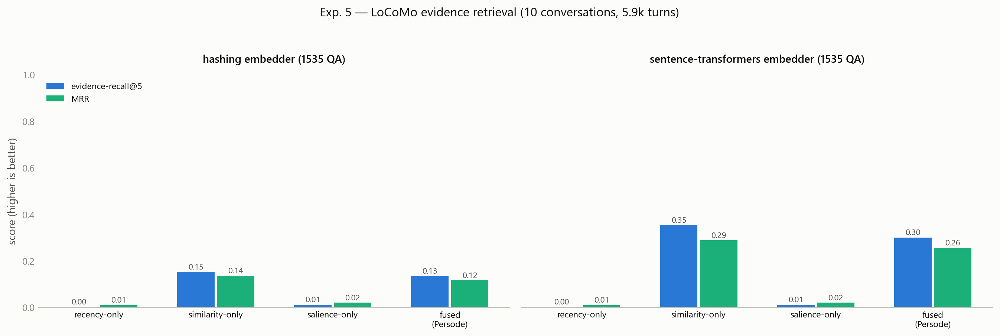

[English](README.md) | **한국어**

[English](README.md) | **한국어** | [中文](README.zh-CN.md)

<div align="center">

# Persode

**에피소드 기억 인식 저널링 에이전트 — 공식 구현**

Jin et al. (2025) [*Persode: Personalized Visual Journaling with Episodic Memory-Aware AI Agent*](https://arxiv.org/abs/2508.20585) 공식 구현.

🏆 **Best Oral Presentation — ICES 2025**

[](https://arxiv.org/abs/2508.20585)
[](https://arxiv.org/abs/2508.20585)
[](pyproject.toml)
[](https://github.com/sukoji/persode/actions/workflows/ci.yml)
[](LICENSE)

</div>

---

Persode는 인간과 유사한 기억 모델을 가진 저널링 챗봇입니다. 최근 사건은 **에빙하우스 곡선**을 따라 희미해지고, 감정적으로 강렬한 사건은 장기 저장으로 **통합(consolidation)** 되며, 검색은 **의미 유사도와 감정 현저성(salience)을 융합**해 적절한 에피소드를 회상한 뒤 일러스트 일기(성찰 텍스트 + 이미지 프롬프트)로 렌더링합니다.

이 저장소는 그 기억 핵심을 결정론적·오프라인으로 구현합니다. GPT-4o / DALL·E 3 호출은 투명 스텁으로 대체되어 API 키 없이 기억 모델을 단위 테스트할 수 있으며, 선택적 어댑터([`persode/llm.py`](persode/llm.py))로 전체 LLM 파이프라인을 사용할 수 있습니다. 아래 실험은 각 알고리즘 메커니즘을 설계에 비추어 검증하며, 유저 스터디는 향후 과제입니다.

## 아키텍처

<p align="center">
  
</p>
<p align="center"><sub><b>Figure 2</b> (<a href="https://arxiv.org/abs/2508.20585">논문</a>). 각 블록은 <code>persode/</code> 모듈에 대응하며, GPT-4o / DALL·E 3는 오프라인 결정론적 구현으로 대체됩니다.</sub></p>

| 모듈 | 논문 | 역할 |
|---|---|---|
| [`memory.py`](persode/memory.py) | §4.2, Eq. 1 | 에빙하우스 감쇠 `d(Δt)=e^(−λΔt)`와 기억 강도 점수 `S = d(Δt)·(wE·E+wR·R+wC·C)/(wE+wR+wC)`, 현저성 조절 통합 |
| [`analyzer.py`](persode/analyzer.py) | §4.2 | Event-Emotion Analyzer: 발화 → 사건, 감정, 강도 E, 해시태그 |
| [`store.py`](persode/store.py) | §3.2 | 벡터 저장소 + Memory Selection Block: 유사도와 현저성을 융합한 검색; 회상 시 기억 강화·감쇠 시계 리셋 |
| [`onboarding.py`](persode/onboarding.py) | §3.1, §4.1 | 온보딩 선호 → 챗봇 페르소나 + 시각 정체성 |
| [`templates.py`](persode/templates.py) | §3.3, §4.3 | Dual-Template 프레임워크: 성찰 일기 + few-shot 시각 프롬프트 템플릿 |
| [`agent.py`](persode/agent.py) | Fig. 2 | `EpisodicMemoryAgent` — ingest → retrieve → respond → journal |
| [`embeddings.py`](persode/embeddings.py) | — | 교체 가능한 임베더: 오프라인 해싱(기본) 또는 sentence-transformers |
| [`llm.py`](persode/llm.py) | §4.1, §4.3 | 선택적 GPT-4o / DALL·E 3 어댑터 + 오프라인 스텁 |

## 빠른 시작

```bash
pip install -e .          # numpy + matplotlib
python examples/demo.py   # 오프라인 엔드-투-엔드 세션
```

```python
from persode import EpisodicMemoryAgent, MemoryStore, OnboardingPreferences

prefs = OnboardingPreferences(
    name="Mina", age=17, glasses=False, fashion_style="trendy",
    hair="dyed yellow hair", background_theme="city", background_style="vibrant",
    conversation_style="emotional", response_length="detailed", personality="empathetic",
)
agent = EpisodicMemoryAgent(preferences=prefs, store=MemoryStore())

agent.ingest("I celebrated my graduation today and I was overjoyed!")
print(agent.respond("I feel proud of myself lately, like when I graduated."))

entry = agent.create_journal("A car splashed water on me and ruined my favorite outfit!")
print(entry.diary)
print(entry.visual_prompt.prompt)
```

선택적 확장: `pip install -e ".[semantic]"` (sentence-transformers), `".[openai]"` (GPT-4o / DALL·E), `".[dev]"` (pytest).

## 실험

네 개의 결정론적 스크립트가 시스템의 각 메커니즘을 검증합니다. 고정 기준 시계와 수작업 라벨 시나리오([`experiments/_scenario.py`](experiments/_scenario.py))로 매 실행이 비트 단위로 동일하며, 그림과 기계 판독 JSON을 [`results/`](results)에 씁니다. 라벨은 객관적입니다(`E ≥ 0.6` = 중요, `나이 > 6일` = 장기).

```bash
python experiments/run_all.py
```

| # | 메커니즘 | 결과 |
|---|---|---|
| **1** | [망각곡선](experiments/exp1_forgetting_curve.py) | 논문의 6일 / ~75% 기준에서 λ = ln 4⁄6 ≈ 0.231/day(반감기 3일); 통합으로 강렬한 기억은 30일에 **S ≈ 0.044**, 중립 기억은 **≈ 0.0003**. |
| **2** | [기억 강도 점수(Eq. 1)](experiments/exp2_memory_scoring.py) | 감정 가중 점수가 한 달 된 강렬한 기억(`lost beloved dog`, E = 0.95)을 균형값의 **×2.6**, 7위 → 5위로 상승. |
| **3** | [현저성 인식 검색](experiments/exp3_retrieval.py) | 어휘적으로 먼 probe에서 융합(α = 0.5)이 장기 감정 recall@3를 **0.60**으로 끌어올림(순수 유사도 **0.40**) — 중립/일반 질의에서의 비용도 함께 공개(아래 상세). |
| **4** | [Dual-Template 생성](experiments/exp4_visual_prompt.py) | 한 발화 → 일기 + 시각 프롬프트; 온보딩 속성 **24/24** 주입, 프로필별 프롬프트 상이, 감정 무드 공유. |
| **5** | [공개 벤치마크 — LoCoMo](experiments/exp5_locomo.py) | 사실형 QA 1,535개 / 5.9k 발화: 상시 융합은 비용(**0.30** vs 순수 RAG **0.35**, recall@5 MiniLM) — 그래서 에이전트가 **질의 감정으로 융합을 게이트**, 동률 회복(**0.35**)하면서 Exp. 3의 감정 재부상 이득은 유지. |
| **6** | [EpiRec — 라벨 벤치마크](experiments/exp6_epirec.py) | [EpiRec](https://github.com/sukoji/epirec)(504 probe, 감정 라벨 저작, 평가 전 코퍼스 동결)에서: 게이트는 순수 RAG와 동률 유지(전체 recall@3 **0.84**), 그러나 상시 융합은 *모든* 층에서 열세 — 키워드 analyzer의 E로는 대규모에서 재부상 이득이 재현 안 됨. 공개된 미해결 문제로 기록. |

<p align="center">
  
  
</p>

### Exp. 3 — 검색 상세

프로토콜은 **사전 등록(pre-registered)** 되어 있습니다: 모든 하이퍼파라미터는 시스템 기본값(α = 0.5, 가중치 (1, 1, 1), top-k = 3, 고정 메트릭 임계값)으로 결과를 보기 전에 확정되며, 평가 결과에 맞춰 튜닝하거나 질의 부분집합을 사후 선택하지 않습니다. 10개 질의(기억당 1개) 전체를 두 표현 조건 — *일반* probe와 *모호* 패러프레이즈(기억당 1개, 균일 규칙: 저장된 텍스트의 내용어를 재사용하지 않음) — 으로 평가합니다. 해싱 임베더; 모든 수치는 회귀 테스트로 고정됩니다. (그림의 *topical-precision@3*은 질의 유사도가 타깃의 절반 이상인 검색 결과의 비율 — 융합이 끌어오는 내용의 drift 검사.)

| 전략 | recall@3 (모호) | · 장기 감정 (n=5) | recall@3 (일반) |
|---|---:|---:|---:|
| recency-only | 0.30 | 0.00 | 0.30 |
| similarity-only (순수 RAG) | 0.30 | 0.40 | **1.00** |
| salience-only (유사도 미사용) | 0.30 | 0.40 | 0.30 |
| fused (α = 0.5, 상시) | **0.40** | **0.60** | 0.80 |
| **gated (에이전트: 질의 E ≥ 0.6일 때만 융합)** | **0.40** | 0.40 | **1.00** |

융합이 얻는 것 — 그리고 치르는 비용 ([`results/exp3_retrieval.json`](results/exp3_retrieval.json)):

- **이득은 한정적:** 어휘 불일치 아래에서 융합은 순수 유사도가 놓치는(0.40) 장기 감정 에피소드를 복구하고(0.60), recency는 도달 불가(0.00).
- **공짜 승리가 아님:** 일반 probe에서는 순수 유사도가 10개 전부 해결(1.00), 융합은 둘을 놓침(0.80); 모호 조건에서 융합은 중립-최근 타깃을 잃고(0.00 vs 0.33) 중립 질의에 감정 기억을 더 끌어들임(intrusion 0.89 vs 0.67) — salience는 *설계상* 감정 콘텐츠 쪽으로 검색을 편향시킴.
- **analyzer가 감정을 볼 수 있는 곳에서는 게이트가 tradeoff를 해소:** 에이전트는 질의 자체가 감정적으로 유의(오프라인 analyzer E ≥ 0.6, 리포의 기존 유의성 상수)할 때만 융합을 적용. gated 검색은 일반 probe에서 유사도의 만점 recall 유지(1.00 vs 상시 융합 0.80), 모호 조건에서 중립-최근 타깃 회복(0.33 vs 0.00), intrusion을 유사도 수준으로 복원(0.67 vs 0.89). 비용: 키워드 analyzer는 의도적으로 감정 단어를 피한 패러프레이즈에서 감정을 못 봐 모호 감정 질의 둘이 게이트를 새어 순수 유사도로 감(장기 감정 0.40 vs 상시 융합 0.60) — 논문의 GPT-4o analyzer를 게이트로 쓰면 개선 여지, 여기서는 미검증.
- **α:** 장기 감정 이득(0.60)은 α ∈ [0.45, 0.70]에서 유지; 양 극단은 0.40으로 복귀. α = 0은 유사도-*배제*가 아니라 salience-*지배*임 — 질의 유사도가 C를 통해 salience 항에 여전히 유입됨; 유사도 완전 배제 기준선은 salience-only 행.
- **임베더:** 의미 임베더(`PERSODE_EMBEDDER=sentence-transformers`)에서는 순수 RAG가 두 조건 모두 recall 1.00 — 위 recall 격차는 어휘 임베더의 산물. salience의 임베더-독립적 효과는 *우선순위화*로, 동등하게 관련된 두 기억이 있을 때 융합이 감정적으로 중요한 쪽을 먼저 랭크(JSON의 `salience_prioritization`).
- **표본 크기:** 수작업 라벨 질의 n = 10; 히트 1개가 recall을 0.10 움직임. 격차는 결정론적 메커니즘 검증으로 읽어야 하며 모집단 추정치가 아님.

<p align="center"></p>

### Exp. 5 — 공개 벤치마크 (LoCoMo)

[LoCoMo](https://github.com/snap-research/locomo) (Maharana et al., ACL 2024)는 초장기 멀티세션 대화(10개 대화, 5,882 발화, 실제 세션 타임스탬프)와 QA마다 정확한 **근거 발화** 주석을 제공 — Memory Selection Block을 LLM 개입 없이 순수 검색으로 채점할 수 있습니다. 프로토콜은 Exp. 3처럼 사전 등록(기억 구성, 동일 4개 전략·기본값, 메트릭, QA 포함 규칙 전부 사전 확정; adversarial 카테고리는 설계상 정답 없음이라 사전 제외). 1,535 QA 평가; CC BY-NC 데이터는 실행 시 다운로드하며 재배포하지 않습니다.

```bash
python experiments/exp5_locomo.py   # 첫 실행 시 데이터 다운로드
```

| 전략 | recall@5 (해싱) | recall@5 (MiniLM) | MRR (MiniLM) |
|---|---:|---:|---:|
| recency-only | 0.00 | 0.00 | 0.01 |
| similarity-only (순수 RAG) | 0.15 | 0.35 | 0.29 |
| salience-only (유사도 미사용) | 0.01 | 0.01 | 0.02 |
| fused (α = 0.5, 상시) | 0.13 | 0.30 | 0.26 |
| **gated (에이전트)** | **0.15** | **0.35** | **0.29** |

<p align="center"></p>

이 결과가 보여주는 것:

- **사실형 QA에서 상시 salience는 비용:** 게이트 없는 융합이 순수 유사도보다 상대 recall@5 ~15% 뒤짐 — 두 임베더, 4개 카테고리, 10개 대화 전부에서 일관(0.302 ± 0.055 vs 0.352 ± 0.068). LoCoMo 질문은 *사실*을 묻기에("When did Caroline…") 감정 현저성 가중은 on-topic 발화를 밀어낼 뿐.
- **감정 게이트가 그 비용을 제거:** 에이전트는 감정적으로 유의한 질의(analyzer E ≥ 0.6 — LoCoMo 질문의 2.9%)에만 융합을 적용하고, gated 검색은 순수 유사도와 소수점 셋째 자리까지 동률(MiniLM 0.3535 vs 0.3533; 해싱 0.154 vs 0.153 — 게이트를 통과한 질의는 융합으로 미세 이득). Exp. 3과 합치면 메커니즘이 완성됨: 감정 재부상엔 융합, 사실 조회엔 유사도 — 시스템 스스로 질의별로 선택.
- **출처 공개:** gated 전략은 첫 실행이 상시 융합의 비용을 드러낸 *뒤에* 추가됨; 게이트 규칙 자체는 리포에 이미 있던 유의성 상수(E ≥ 0.6)를 재사용하며 평가 전에 확정 — LoCoMo 결과에 맞춰 튜닝한 것 없음, 게이트 없는 행도 계속 보고됨.
- **어디에도 천장 없음:** 최고 구성이 recall@5 0.35 — LoCoMo가 어려운 검색 벤치마크라는 기존 평가와 정합; 포화되거나 골라낸 수치 없음.

### Exp. 6 — EpiRec: 라벨 있는 독립 데이터에서의 재부상 주장

Exp. 5 이후 남은 공백은 감정 현저성 라벨을 가진 공개 벤치마크가 없다는 것 — 감정 재부상 주장이 Exp. 3의 수작업 n = 10 시나리오에 의존했음. [EpiRec](https://github.com/sukoji/epirec)이 그 공백을 메움: 12 페르소나, 타임스탬프 달린 일기 에피소드 168개(강도/정서가 라벨 저작), probe 504개 — 사실형, 감정 명시 성찰형, 그리고 **감정 단어·내용어 재사용 없는**(기계 검증) 암시 성찰형. 제작은 사전 등록, 코퍼스는 Persode 전략 실행 전 동결; 저작 라벨은 검색에 입력되지 않음 — E는 시스템 자체 analyzer 산출이라, 파이프라인 전체가 한 번도 본 적 없는 라벨에 대해 시험됨.

recall@3, MiniLM 임베딩 (해싱·전체 층은 [`results/exp6_epirec.json`](results/exp6_epirec.json)). 재현 가능한 hashing 실행의 504개 full ranking과 EpiRec evaluator bootstrap CI는 [`results/exp6_epirec_rankings/`](results/exp6_epirec_rankings/)에 함께 공개:

| 전략 | 사실형 | 성찰-명시 | 성찰-암시 | 전체 |
|---|---:|---:|---:|---:|
| similarity-only (순수 RAG) | 1.00 | 0.88 | **0.66** | **0.84** |
| fused (α = 0.5, 상시) | 0.99 | 0.82 | 0.60 | 0.80 |
| **gated (에이전트)** | 1.00 | 0.87 | **0.66** | **0.84** |

- **게이트는 규모에서도 제 역할**: 세 probe 유형 모두 순수 유사도와 동률(성찰 probe의 13%에서 발화).
- **정직한 헤드라인은 부정적**: 상시 융합이 모든 층에서 열세 — 설계 목표였던 고강도 감정 에피소드에서조차(암시-high 0.60 vs 0.63). Exp. 3의 소규모 재부상 이득은 키워드 analyzer의 E로는 독립 데이터에서 재현되지 않음: salience prior가 값을 하려면 더 강한 감정 추정기(논문의 GPT-4o analyzer)가 필요. 이것이 시스템의 문서화된 미해결 문제이며, EpiRec 암시 층(최고 0.66)이 닫아야 할 헤드룸.

## 테스트

```bash
python -m pytest    # 40개 테스트, 네트워크 불필요
```

감쇠 보정, Eq. 1 점수·통합, 검색 융합·강화, RAG 기반 응답, 저널 회상 중복 제거, analyzer 추출, 템플릿 결정성, 그리고 위 모든 수치를 고정하는 결과 회귀 검사를 커버합니다 — 융합의 비용(일반 probe·중립 질의 손실, LoCoMo 사실형 QA 격차) 보고가 사라지면 실패하는 정직성 가드 포함. 선택 의존성이 필요한 테스트 둘: 의미 임베더, 다운로드된 LoCoMo 데이터.

## 구현 노트

**논문에 명시.** Eq. 1 기억 강도 점수(§4.2); 에빙하우스 감쇠 `d(Δt)=e^(−λΔt)`(§4.2); 6일 / ~75% 단기 창(§3.2); Dual-Template 프레임워크(§3.3, §4.3); 온보딩 → 페르소나·시각 정체성(§3.1, §4.1); Event-Emotion Analyzer와 RAG Memory Selection Block(§3.2).

**이 코드에서 설정**(논문이 값을 열어둔 부분). λ = ln 4⁄6 (6일 / 25% 기준에서 유도); 통합 `λ_eff = λ·(1 − γ·k)` — 현저성 높은 기억이 단기 창 이후에도 유지되게 함; 검색 융합 `α·similarity + (1−α)·salience`, α = 0.5 (유사도가 C를 통해 salience에도 유입되므로 동일 가중치에서 α = 0.5의 실효 유사도 가중치는 ≈ 0.67); 검색의 **감정 게이트**(질의의 analyzer E ≥ 0.6일 때만 융합, 아니면 순수 유사도 — Exp. 5에서 동기); 회상 시 강화는 `last_recalled` 기준으로 감쇠 시계를 재시작하며 형성 시점은 절대 덮어쓰지 않음(간격 반복); GPT-4o / DALL·E 3 대체용 오프라인 어휘·템플릿·해싱 스텁. Exp. 3 평가 프로토콜은 이 기본값들로 사전 등록 — 결과에 맞춘 하이퍼파라미터·질의 선택 없음.

**미포함.** 유저 스터디(향후 과제)와 실제 이미지 생성; 오프라인 analyzer는 키워드 기반 — 감정 게이트의 한계(감정 단어를 피한 표현을 놓침)이자, Exp. 6이 보여주듯 salience prior 자체의 한계: EpiRec 라벨 코퍼스에서 키워드 유래 E로 구동한 융합은 순수 유사도 대비 재부상 이득이 없음. 따라서 메커니즘의 가치는 현재 더 강한 E 추정기(논문의 GPT-4o analyzer — 여기선 미검증)에 조건부. 저널링 경험 자체의 최종 검증은 여전히 향후 유저 스터디.

## 인용

```bibtex
@inproceedings{jin2025persode,
  title     = {Persode: Personalized Visual Journaling with Episodic Memory-Aware AI Agent},
  author    = {Jin, Seokho and Kim, Manseo and Byun, Sungho and Kim, Hansol and
               Lee, Jungmin and Baek, Sujeong and Kim, Semi and Park, Sanghum and Park, Sung},
  booktitle = {ICES},
  year      = {2025},
  note      = {Best Oral Presentation. arXiv:2508.20585},
  eprint    = {2508.20585},
  archivePrefix = {arXiv},
  primaryClass  = {cs.HC}
}
```

## 라이선스

[MIT](LICENSE)
