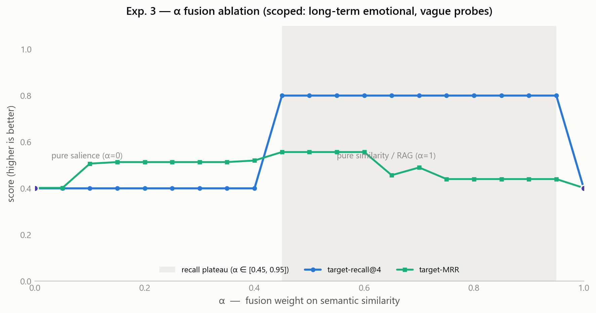

**English** | [한국어](README.ko.md)

<div align="center">

# Persode

**Episodic memory-aware journaling agent — official implementation**

Official implementation of
[*Persode: Personalized Visual Journaling with Episodic Memory-Aware AI Agent*](https://arxiv.org/abs/2508.20585) (Jin et al., 2025)

🏆 **Best Oral Presentation — ICES 2025**

[](https://arxiv.org/abs/2508.20585)
[](https://arxiv.org/abs/2508.20585)
[](pyproject.toml)
[](https://github.com/sukoji/persode/actions/workflows/ci.yml)
[](LICENSE)

</div>

---

Persode is a journaling chatbot with a human-like memory model: recent events fade on an **Ebbinghaus curve**, emotionally intense ones **consolidate** into long-term storage, and retrieval **fuses semantic similarity with emotional salience** to resurface the right episode — then renders it as an illustrated diary entry (reflective text + image prompt).

This repository implements that memory core deterministically and offline. The GPT-4o / DALL·E 3 calls are replaced by transparent stubs so the memory model is unit-testable with no API key; optional adapters ([`persode/llm.py`](persode/llm.py)) enable the full LLM pipeline. The experiments below validate each algorithmic mechanism against the design; the user study is planned as future work.

## Architecture

<p align="center">
  
</p>
<p align="center"><sub><b>Figure 2</b> from the <a href="https://arxiv.org/abs/2508.20585">paper</a>. Each block maps to a module in <code>persode/</code>; GPT-4o / DALL·E 3 are replaced offline by deterministic equivalents.</sub></p>

| Module | Paper | Role |
|---|---|---|
| [`memory.py`](persode/memory.py) | §4.2, Eq. 1 | Ebbinghaus decay `d(Δt)=e^(−λΔt)` and Memory-Strength Scoring `S = d(Δt)·(wE·E+wR·R+wC·C)/(wE+wR+wC)`, with salience-modulated consolidation |
| [`analyzer.py`](persode/analyzer.py) | §4.2 | Event-Emotion Analyzer: utterance → event, emotion, intensity E, hashtags |
| [`store.py`](persode/store.py) | §3.2 | Vector store + Memory Selection Block: retrieval fusing similarity with salience; recall reinforces a memory and resets its decay clock |
| [`onboarding.py`](persode/onboarding.py) | §3.1, §4.1 | Onboarding preferences → chatbot persona + visual identity |
| [`templates.py`](persode/templates.py) | §3.3, §4.3 | Dual-Template framework: reflective diary + few-shot visual-prompt templates |
| [`agent.py`](persode/agent.py) | Fig. 2 | `EpisodicMemoryAgent` — ingest → retrieve → respond → journal |
| [`embeddings.py`](persode/embeddings.py) | — | Pluggable embedders: offline hashing (default) or sentence-transformers |
| [`llm.py`](persode/llm.py) | §4.1, §4.3 | Optional GPT-4o / DALL·E 3 adapters with offline stubs |

## Quickstart

```bash
pip install -e .          # numpy + matplotlib
python examples/demo.py   # end-to-end session, offline
```

```python
from persode import EpisodicMemoryAgent, MemoryStore, OnboardingPreferences

prefs = OnboardingPreferences(
    name="Mina", age=17, glasses=False, fashion_style="trendy",
    hair="dyed yellow hair", background_theme="city", background_style="vibrant",
    conversation_style="emotional", response_length="detailed", personality="empathetic",
)
agent = EpisodicMemoryAgent(preferences=prefs, store=MemoryStore())

agent.ingest("I celebrated my graduation today and I was overjoyed!")
print(agent.respond("I feel proud of myself lately, like when I graduated."))

entry = agent.create_journal("A car splashed water on me and ruined my favorite outfit!")
print(entry.diary)
print(entry.visual_prompt.prompt)
```

Optional extras: `pip install -e ".[semantic]"` (sentence-transformers), `".[openai]"` (GPT-4o / DALL·E), `".[dev]"` (pytest).

## Experiments

Four deterministic scripts validate each mechanism of the system. A fixed reference clock and hand-labelled scenario ([`experiments/_scenario.py`](experiments/_scenario.py)) make every run bit-identical; figures and machine-readable JSON are written to [`results/`](results). Labels are objective (`E ≥ 0.6` = significant, `age > 6 d` = long-term).

```bash
python experiments/run_all.py
```

| # | Mechanism | Result |
|---|---|---|
| **1** | [Forgetting curve](experiments/exp1_forgetting_curve.py) | λ = ln 4⁄6 ≈ 0.231/day from the paper's 6-day / ~75 % anchor (half-life 3 d); consolidation holds an intense memory at **S ≈ 0.044** vs **≈ 0.0003** for a neutral one at 30 days. |
| **2** | [Memory-strength scoring (Eq. 1)](experiments/exp2_memory_scoring.py) | Emotion-weighted scoring raises a month-old intense memory (`lost beloved dog`, E = 0.95) to **×2.6** its balanced value, 7th → 5th in the store. |
| **3** | [Salience-aware retrieval](experiments/exp3_retrieval.py) | On long-term emotional queries with lexically-distant phrasing, fusion (α = 0.5) reaches **recall@4 0.80** vs **0.40** for pure similarity. |
| **4** | [Dual-Template generation](experiments/exp4_visual_prompt.py) | One utterance → diary + visual prompt; **24/24** onboarding attributes injected, prompts differ by profile, emotion-mood shared. |

<p align="center">
  
  
</p>

### Exp. 3 — retrieval detail

Evaluated on 5 long-term emotional queries, phrased as vague paraphrases so lexical overlap with the stored episode is low. α and top-k are grid-searched over 8,064 configs ([`tune_exp3_loop.py`](experiments/tune_exp3_loop.py)); configs scoring ≥ 0.99 recall are rejected. Hashing embedder.

| Strategy | recall@4 | MRR | topical-precision@4 |
|---|---:|---:|---:|
| recency-only | 0.00 | 0.00 | 0.65 |
| similarity-only (pure RAG) | 0.40 | 0.40 | **1.00** |
| **fused (α = 0.5)** | **0.80** | **0.56** | 0.95 |

Robustness ([`results/exp3_retrieval.json`](results/exp3_retrieval.json)):

- **Full 10-query set:** fusion and pure RAG tie at 0.70 recall; the gain is specific to long-term emotional recall, not universal.
- **Plain phrasing:** with non-vague probes, pure RAG already recalls 1.00 — the gap requires lexical mismatch.
- **α:** recall stays 0.80 across α ∈ [0.45, 0.95]; only pure similarity (α = 1) and pure salience (α = 0) drop to 0.40.
- **Embedder:** with a semantic embedder (`PERSODE_EMBEDDER=sentence-transformers`), pure RAG reaches recall 1.00 — the recall gain above reflects the lexical embedder. Salience's embedder-independent effect is *prioritization*: given two equally-relevant memories, fusion ranks the emotionally-significant one first (`salience_prioritization` in the JSON).

<p align="center"></p>

## Tests

```bash
python -m pytest    # 37 tests, no network
```

Cover decay calibration, Eq. 1 scoring and consolidation, retrieval fusion and reinforcement, RAG-grounded responses, journal recall de-duplication, analyzer extraction, template determinism, and results-regression checks that pin every number above. One further test runs only with the semantic embedder installed.

## Implementation notes

**Specified in the paper.** Eq. 1 Memory-Strength Scoring (§4.2); Ebbinghaus decay `d(Δt)=e^(−λΔt)` (§4.2); six-day / ~75 % short-term window (§3.2); Dual-Template framework (§3.3, §4.3); onboarding → persona and visual identity (§3.1, §4.1); Event-Emotion Analyzer and the RAG Memory Selection Block (§3.2).

**Set in this code** (where the paper leaves values open). λ = ln 4⁄6 (from the 6-day / 25 % anchor); consolidation `λ_eff = λ·(1 − γ·k)`, so salient memories persist past the short-term window; retrieval fusion `α·similarity + (1−α)·salience`, α = 0.5; reinforcement on recall (spaced repetition); offline lexicon / template / hashing stubs standing in for GPT-4o / DALL·E 3.

**Not included.** The user study (future work) and real image generation; the evaluation scenario is a small hand-labelled set, not a public benchmark; the offline analyzer is keyword-based.

## Citation

```bibtex
@inproceedings{jin2025persode,
  title     = {Persode: Personalized Visual Journaling with Episodic Memory-Aware AI Agent},
  author    = {Jin, Seokho and Kim, Manseo and Byun, Sungho and Kim, Hansol and
               Lee, Jungmin and Baek, Sujeong and Kim, Semi and Park, Sanghum and Park, Sung},
  booktitle = {ICES},
  year      = {2025},
  note      = {Best Oral Presentation. arXiv:2508.20585},
  eprint    = {2508.20585},
  archivePrefix = {arXiv},
  primaryClass  = {cs.HC}
}
```

## License

[MIT](LICENSE)
