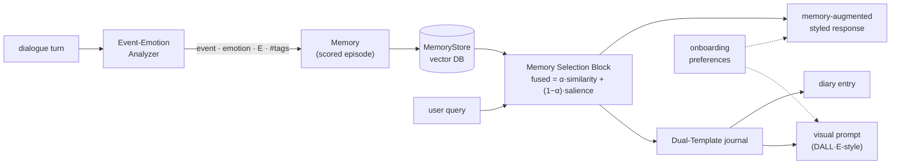
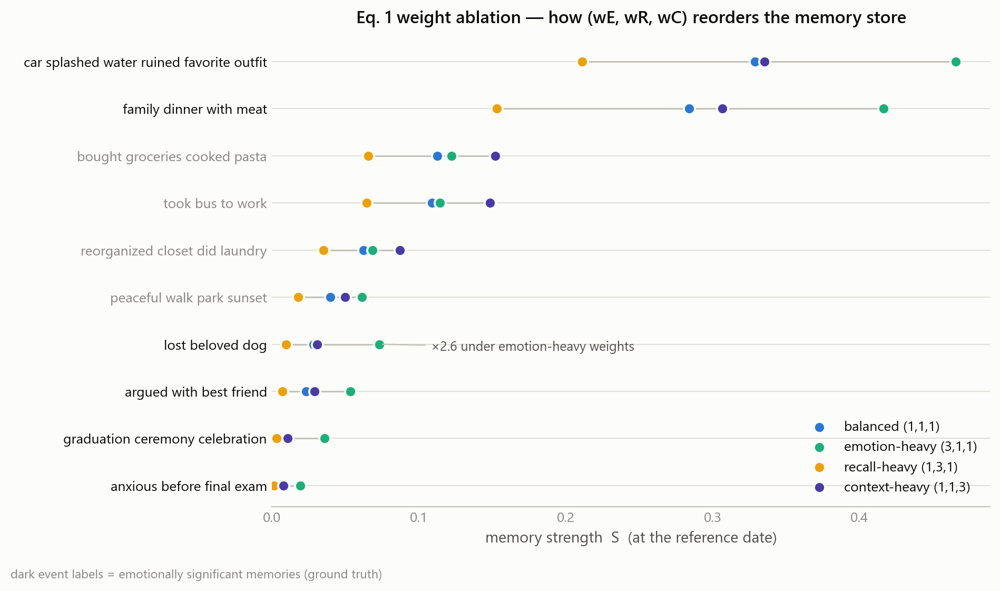

<div align="center">

# Persode

**Episodic memory-aware journaling agent — a faithful, offline reference implementation**

Reproduces the algorithmic core of
[*Persode: Personalized Visual Journaling with Episodic Memory-Aware AI Agent*](https://arxiv.org/abs/2508.20585) (Jin et al., 2025)

[](https://arxiv.org/abs/2508.20585)
[](pyproject.toml)
[](tests)
[](LICENSE)
[](#design-choices)

</div>

---

People don't remember everything equally: recent events fade fast, but emotionally intense, frequently recalled moments stick. Persode builds a journaling chatbot on exactly that observation — an **Ebbinghaus forgetting curve** governs short-term memory, a **memory-strength score** decides what survives into long-term storage, and retrieval fuses **semantic similarity with emotional salience** so that the right memory resurfaces at the right moment. The remembered episode is then rendered as an **illustrated diary entry**: a reflective text plus a personalized image-generation prompt.

This repository implements that entire pipeline **deterministically and offline** — every equation, threshold, and template is inspectable, unit-tested, and reproducible without any paid API. Optional GPT-4o / DALL·E 3 adapters slot in behind the same interfaces.

## Architecture



| Module | Paper component | What it does |
|---|---|---|
| [`persode/memory.py`](persode/memory.py) | §3.2, Eq. 1 | Ebbinghaus decay `d(Δt)=e^(−λΔt)` calibrated to a 25 % retention at day 6, and Memory-Strength Scoring `S = d(Δt)·(wE·E + wR·R + wC·C)/(wE+wR+wC)` with salience-modulated consolidation |
| [`persode/analyzer.py`](persode/analyzer.py) | Fig. 2 | Event-Emotion Analyzer: utterance → event, emotion, intensity E, hashtags (offline lexicon or GPT-4o) |
| [`persode/store.py`](persode/store.py) | Fig. 2 | Vector store + **Memory Selection Block**: retrieval fusing cosine similarity with salience; recall reinforces a memory and resets its decay clock |
| [`persode/embeddings.py`](persode/embeddings.py) | — | Pluggable embedders: offline hashing (default) or sentence-transformers |
| [`persode/onboarding.py`](persode/onboarding.py) | §3.1 | Onboarding preferences → chatbot persona prompt + visual identity |
| [`persode/templates.py`](persode/templates.py) | §3.3, §4.3–4.4 | **Dual-Template framework**: reflective diary template + few-shot visual-prompt template |
| [`persode/agent.py`](persode/agent.py) | Fig. 2 | `EpisodicMemoryAgent` — ingest → retrieve → respond → journal |
| [`persode/llm.py`](persode/llm.py) | §4.1 | Optional GPT-4o / DALL·E 3 adapters with offline stubs |

## Quickstart

```bash
pip install -e .          # only numpy + matplotlib
python examples/demo.py   # end-to-end session, fully offline
```

```python
from persode import EpisodicMemoryAgent, MemoryStore, OnboardingPreferences

prefs = OnboardingPreferences(
    name="Mina", age=17, glasses=False, fashion_style="trendy",
    hair="dyed yellow hair", background_theme="city", background_style="vibrant",
    conversation_style="emotional", response_length="detailed", personality="empathetic",
)
agent = EpisodicMemoryAgent(preferences=prefs, store=MemoryStore())

agent.ingest("I celebrated my graduation today and I was overjoyed!")
print(agent.respond("I feel proud of myself lately, like when I graduated."))

entry = agent.create_journal("A car splashed water on me and ruined my favorite outfit!")
print(entry.diary)                 # reflective diary entry
print(entry.visual_prompt.prompt)  # personalized image-generation prompt
```

Optional extras: `pip install -e ".[semantic]"` (sentence-transformers), `".[openai]"` (GPT-4o / DALL·E adapters), `".[dev]"` (pytest).

## Experiments

Four standalone scripts under [`experiments/`](experiments) validate each mechanism against the paper's claims. All are deterministic (fixed reference clock, hand-labelled scenario in [`experiments/_scenario.py`](experiments/_scenario.py)) and run offline in seconds, writing figures + machine-readable JSON to [`results/`](results).

### Exp. 1 — Forgetting-curve calibration

The paper anchors short-term memory to a six-day window with a ~75 % retention drop. Solving `e^(−6λ) = 0.25` gives **λ = ln 4⁄6 ≈ 0.231/day** (half-life 3 days); the assertion in the script verifies the calibration to machine precision. The right panel shows the consolidation mechanism: salience slows the decay (`λ_eff = λ·(1 − γ·k)`), so an emotionally intense memory is still retrievable after a month while a neutral one has effectively vanished.

<p align="center"></p>

### Exp. 2 — Memory-Strength Scoring (Eq. 1) weight ablation

Ten scenario memories scored under four (wE, wR, wC) weightings. Two things to read off the plot: recency dominates the *absolute* scale (the two youngest emotional events top the board — the short-term window at work), and the weights control *what survives aging* — under emotion-heavy weights the month-old "lost beloved dog" memory scores **×2.6** its balanced value, reordering the long tail exactly as Eq. 1 intends.

<p align="center"></p>

### Exp. 3 — Salience-aware retrieval (Memory Selection Block)

Three retrieval strategies over the same store and four emotional queries, judged on three metrics: **sig-precision@3** (are retrieved memories emotionally significant?), **target-recall@3** (is the topically correct memory found?), and **long-term recall@3** (does anything older than the six-day window surface?).

| Strategy | sig-precision@3 | target-recall@3 | long-term recall@3 |
|---|---:|---:|---:|
| recency-only (short buffer) | 0.33 | 0.00 | 0.00 |
| similarity-only (pure RAG) | 0.75 | 1.00 | 1.00 |
| **fused (Persode, α = 0.5)** | **1.00** | **1.00** | **1.00** |

A recency buffer structurally cannot reach past its window. Pure RAG finds the right memory but pads the remaining slots with whatever is lexically close — including mundane chores. The fused score keeps the topical match at rank 1 *and* fills the tail with emotionally significant memories instead. (Honest caveat: sig-precision rewards salience, not topicality — that is why target-recall is reported alongside it; on this 10-memory scenario the fused tail is salience-driven by design.)

<p align="center"></p>

### Exp. 4 — Dual-Template journal generation

The paper's flagship vignettes end-to-end: one dialogue turn becomes a reflective diary entry **and** a DALL·E-ready visual prompt. Running identical utterances under two contrasting onboarding profiles changes the visual prompt deterministically — same event, different person:

| | Profile **Mina** (15, trendy, city) | Profile **Jun** (27, minimal, nature) |
|---|---|---|
| Detected episode | `angry`, E = 0.96 | `angry`, E = 0.96 |
| Visual prompt | soft anime illustration, **a 15-year-old character, dyed yellow hair, no glasses, trendy fashion, vibrant city background**, depicting car splashed puddle water…, tense dramatic lighting, stormy frustrated mood | soft anime illustration, **a 27-year-old character, short black hair, wearing glasses, minimal fashion, minimal nature background**, depicting car splashed puddle water…, tense dramatic lighting, stormy frustrated mood |

Full transcripts (both profiles × both vignettes, diaries included): [`results/exp4_journals.md`](results/exp4_journals.md)

## Tests

```bash
python -m pytest    # 25 tests, < 1 s, no network
```

Covering: decay calibration and clamping, Eq. 1 scoring / weight normalisation / consolidation, retrieval fusion and reinforcement, analyzer extraction, and template determinism across profiles.

## Design choices

- **Offline-first.** The paper's pipeline calls GPT-4o and DALL·E 3; this implementation replaces both with transparent deterministic components (lexicon analyzer, template composer, hashing embedder) so the *memory mathematics* — the paper's actual contribution — can be tested in isolation. The LLM adapters in [`persode/llm.py`](persode/llm.py) restore the paper's original configuration.
- **Consolidation over plain decay.** A single fixed exponential would erase *every* memory within a month — the opposite of the paper's long-term store. Following Levels-of-Processing, salience slows decay (`λ_eff = λ·(1 − γ·k)`), which is what produces the crossover in Exp. 1.
- **Reinforcement.** Retrieving a memory bumps its recall count and resets its decay clock (spaced repetition, as in MemoryBank/LUFY) — significant memories that keep coming up stay alive.

## Scope & limitations

- The UX study (N = 20) and actual image generation from the paper are out of scope; offline text output is intentionally template-simple.
- The evaluation scenario is a small hand-labelled synthetic set built from the paper's own vignettes — good for verifying mechanisms, not a public benchmark.
- The offline lexicon analyzer is keyword-based; nuanced or sarcastic emotion needs the LLM backend.

## Citation

```bibtex
@article{jin2025persode,
  title   = {Persode: Personalized Visual Journaling with Episodic Memory-Aware AI Agent},
  author  = {Jin et al.},
  journal = {arXiv preprint arXiv:2508.20585},
  year    = {2025}
}
```

## License

[MIT](LICENSE)
